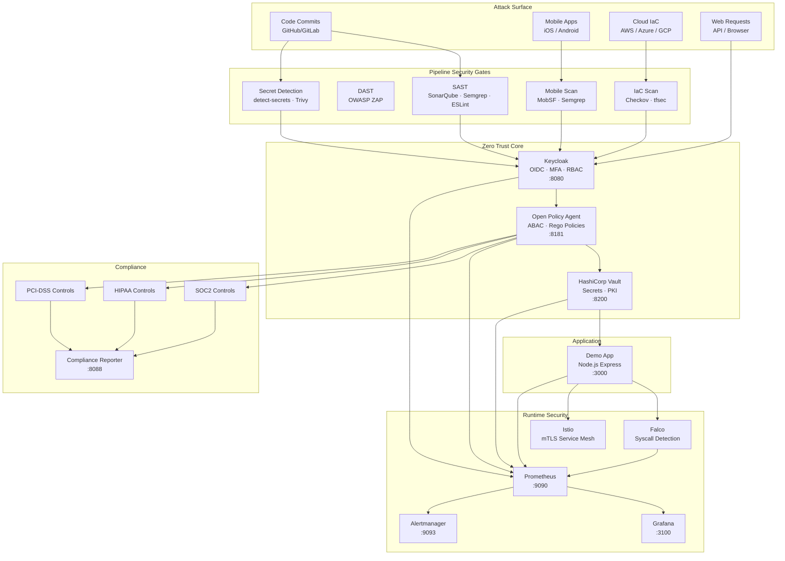

# Architecture — ControlPlane

## Defense-in-Depth Architecture

The platform implements five security domains that work together through a shared Zero Trust core. Every request flowing from an outer domain inward must pass through the Identity & Policy Plane.



---

## Service Topology

```
portfolio-net (172.20.0.0/16)
│
├── Tier 1 — Shared Security Infrastructure
│   ├── vault:8200          HashiCorp Vault (dev mode for local demo)
│   ├── vault-init          One-time init container (seeds policies + secrets)
│   ├── keycloak:8080       Keycloak OIDC (zero-trust realm, MFA, brute-force protection)
│   ├── opa:8181            Open Policy Agent (ABAC policies, audit log)
│   ├── prometheus:9090     Metrics aggregation (all services scraped)
│   ├── alertmanager:9093   Alert routing → Mailhog
│   ├── grafana:3100        Security dashboards (live attack visualization)
│   └── mailhog:8025/1025   Email capture (replaces production SMTP)
│
├── Tier 2 — Application Pipeline
│   ├── demo-app:3000       Node.js Express (Vault-backed secrets, /metrics, /api-docs)
│   └── sonarqube:9000      SAST dashboard (code quality + security rules)
│
├── Tier 3 — Compliance
│   └── compliance-reporter:8088   Flask dashboard (SOC2/HIPAA/PCI live status)
│
├── Tier 4 — Mobile Security
│   └── mobsf:8008          MobSF (static + dynamic mobile security analysis)
│
└── Tier 5 — Demo Attack Infrastructure
    └── attacker            Alpine container with demo scenario scripts
```

---

## Zero Trust Data Flow

```
1. User Request
      │
      ▼
2. Keycloak (Authentication)
   ├── Verify credentials
   ├── Enforce MFA (TOTP)
   ├── Issue JWT with roles/groups
   └── Log LOGIN event → Prometheus
      │
      ▼
3. OPA (Authorization)
   ├── Evaluate ABAC policy (role + network + MFA)
   ├── Emit policy decision log
   └── Increment policy_violations_total if denied
      │
      ▼  (only if allowed)
4. Vault (Secret Resolution)
   ├── Validate token scope
   ├── Issue short-lived credentials
   └── Log secret access → audit.log
      │
      ▼
5. Application
   ├── Process request
   ├── Emit /metrics
   └── Log to stdout (structured JSON)
      │
      ▼
6. Prometheus → Grafana → Alertmanager
   ├── Scrape all /metrics endpoints every 15s
   ├── Evaluate alert rules (security-monitoring.yaml)
   └── Route critical alerts → email (Mailhog)
```

---

## MITRE ATT&CK Coverage

| Tactic               | Technique                     | Mitigation                            |
| -------------------- | ----------------------------- | ------------------------------------- |
| Initial Access       | T1078 Valid Accounts          | Keycloak MFA + brute-force protection |
| Credential Access    | T1110 Brute Force             | Keycloak `failureFactor=3` + lockout  |
| Privilege Escalation | T1548 Abuse Elevation         | OPA ABAC policy enforcement           |
| Lateral Movement     | T1021 Remote Services         | Istio mTLS + network policies         |
| Defense Evasion      | T1027 Obfuscated Files        | Semgrep + MobSF static analysis       |
| Exfiltration         | T1552 Credentials in Files    | detect-secrets + Trivy + Vault        |
| Impact               | T1565 Data Manipulation       | Compliance drift detection            |
| Supply Chain         | T1195 Supply Chain Compromise | Trivy + SBOM generation               |

---

## Compliance Framework Mapping

| Framework    | Controls        | Where Enforced                        |
| ------------ | --------------- | ------------------------------------- |
| SOC2 Type II | CC1.0–CC9.0     | OPA policies + Compliance Reporter    |
| HIPAA        | §164.312        | Access controls + audit logging       |
| PCI-DSS      | Req 1–12        | Network policies + Vault + encryption |
| GDPR         | Articles 25, 32 | Data minimization + audit trail       |

---

## Production vs. Demo Differences

| Aspect            | Demo (docker-compose)       | Production                        |
| ----------------- | --------------------------- | --------------------------------- |
| Vault mode        | Dev (in-memory, root token) | Integrated storage + AWS KMS seal |
| Vault auth        | Static root token           | Kubernetes service accounts       |
| Keycloak DB       | H2 in-memory                | PostgreSQL                        |
| SSL/TLS           | Disabled (localhost)        | Full TLS via Istio/cert-manager   |
| OPA working hours | Always true                 | Time-bounded Mon–Fri 09–17 UTC    |
| Secrets           | Plaintext env vars          | Vault dynamic credentials         |
| K8s               | None                        | EKS with Kyverno policy engine    |

See `shared/infrastructure/vault/vault-config-prod.hcl` for the production Vault configuration.
